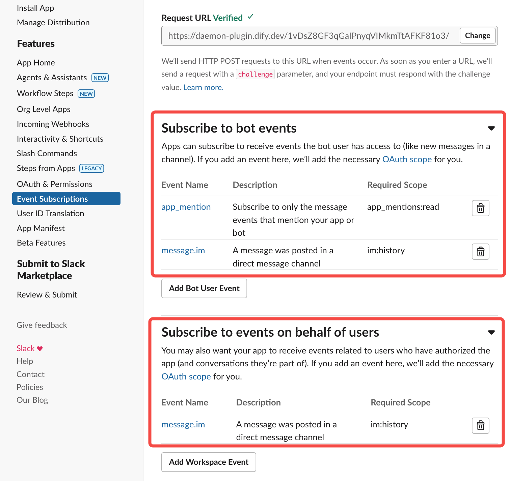

## Slack Bot

**Author:** yoshiki-0428  
**Version:** 0.0.5
**Type:** plugin

[日本語版はこちら (Japanese Version)](./README_ja.md)

### Description

Follow these steps to integrate the Slack plugin:

1. **Create a Slack App**

   - Either create an app from a manifest or from scratch
   - Name your app and select your target workspace
     
     

2. **Configure App Settings**

   - Enable Incoming Webhooks
   - Install the app to your workspace
   - Choose a channel for message delivery
   - Locate your "Bot User OAuth Token" in settings
     
     
     

3. **Set Up Dify Endpoint**

   - Create a new endpoint with a custom name
   - Input your Bot User OAuth Token
   - Optionally specify a Channel ID to restrict the bot to a specific channel
   - Select Event Types to determine how the bot responds:
     - App Mentions Only: Bot only responds when directly mentioned
     - Channel Messages: Bot responds to all messages in the channel
     - Both Mentions and Messages: Bot responds to both mentions and regular messages
   - Set "Allow Retry" to false (recommended to prevent duplicate messages)
   - Link to your Dify chatflow/chatbot/agent
   - Save and copy the generated endpoint URL

    

      
      
    

4. **Complete Slack App Configuration**

   - Enable Event Subscriptions
   - Paste the Dify endpoint URL as the Request URL
   - Add required OAuth scopes for Event Subscriptions
   - Configure App's OAuth & Permissions with necessary scopes
     - For file handling, ensure you add `files:read` scope
     - For responding to channel messages, add `channels:history` scope
     
     

     

5. **Final Steps**
   - Reinstall the app to your workspace if you made changes
   - Add the bot to your chosen channel
   - Start interacting by @mentioning the bot in messages or sending regular messages (depending on your event type selection)
   - The bot can now recognize when files are attached to messages
     
     

### New Features

- **Channel Selection**: You can now specify a particular Slack channel ID for the bot to monitor. Leave this field empty to have the bot respond to events from all channels.
- **Event Type Selection**: Choose which types of events the bot should respond to:
  - App Mentions Only: The bot only responds when directly mentioned with @
  - Channel Messages: The bot responds to all messages in the channel
  - Both: The bot responds to both mentions and regular messages
- **File Integration**: The bot can now process files attached to Slack messages and send them to Dify workflows.
  - Files attached to messages are automatically uploaded to Dify
  - **Important**: Your Dify workflow must include the `files` input parameter to receive and process these files
  - You can configure the Dify API key in the plugin settings for direct file uploads
- **User Filtering**: You can now specify user IDs to ignore, preventing the bot from responding to specific users
