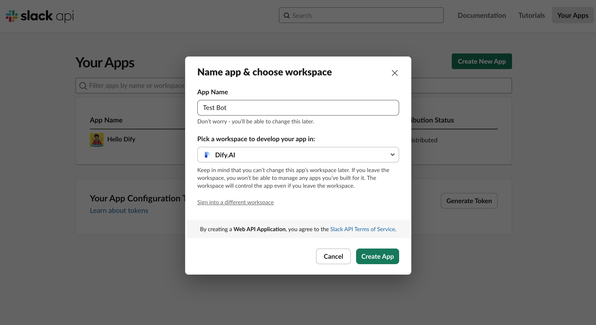
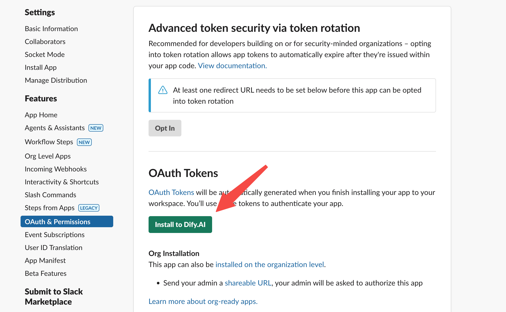
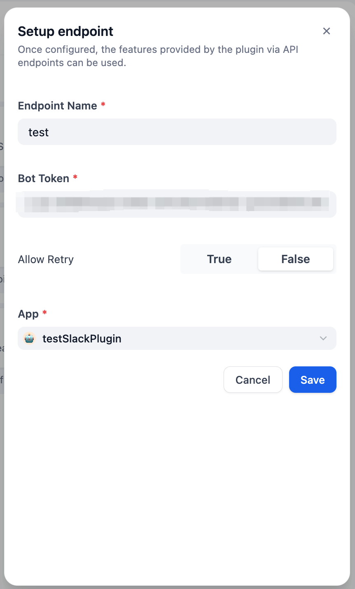
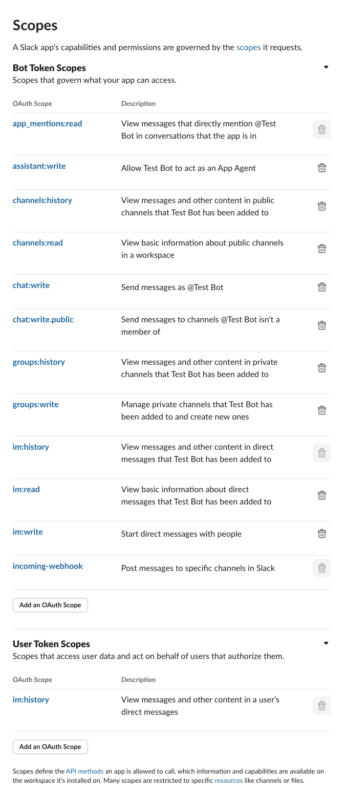

## Slack Bot

**作者:** yoshiki-0428  
**バージョン:** 0.0.5
**タイプ:** plugin

### 説明

以下の手順に従って、Slackプラグインを設定してください：

1. **Slack Appの作成**

   - マニフェストから、または最初から新しいアプリを作成します
   - アプリに名前を付け、対象のワークスペースを選択します
     
     

2. **アプリ設定の構成**

   - 受信Webhookを有効にします
   - アプリをワークスペースにインストールします
   - メッセージ配信用のチャンネルを選択します
   - 設定で「Bot User OAuth Token」を見つけます
     
     
     

3. **Difyエンドポイントの設定**

   - カスタム名で新しいエンドポイントを作成します
   - Bot User OAuth Tokenを入力します
   - 必要に応じて、ボットを特定のチャンネルに制限するためのチャンネル名を指定します
   - ボットの応答方法を決めるイベントタイプを選択します：
     - アプリのメンションのみ：ボットは直接メンションされた場合にのみ応答します
     - チャンネルメッセージ：ボットはチャンネル内のすべてのメッセージに応答します
     - メンションとメッセージの両方：ボットはメンションと通常のメッセージの両方に応答します
   - 「再試行を許可」をオフにします（重複メッセージを防ぐために推奨）
   - Difyのチャットフロー/チャットボット/エージェントを選択します
   - 生成されたエンドポイントURLを保存してコピーします

    

      
      
    

4. **Slack Appの設定を完了**

   - イベントサブスクリプションを有効にします
   - DifyエンドポイントURLをリクエストURLとして貼り付けます
   - イベントサブスクリプションに必要なOAuthスコープを追加します
   - アプリのOAuth＆権限に必要なスコープを設定します
     - ファイル処理のために、`files:read`スコープを追加してください
     - チャンネルメッセージに応答するために、`channels:history`スコープを追加してください
     
     

     

5. **最終ステップ**
   - 変更を加えた場合は、アプリをワークスペースに再インストールします
   - ボットを選択したチャンネルに追加します
   - メッセージで@メンションするか、通常のメッセージを送信して（イベントタイプの選択に応じて）対話を開始します
   - ボットはメッセージに添付されたファイルを認識できるようになりました
     
     

### 新機能

- **チャンネル選択**: ボットが監視する特定のSlackチャンネルを指定できるようになりました。すべてのチャンネルからのメッセージにボットが応答するようにするには、このフィールドを空のままにしてください。
- **イベントタイプの選択**: ボットが応答するイベントのタイプを選択できます：
  - アプリのメンションのみ：ボットは@で直接メンションされた場合にのみ応答します
  - チャンネルメッセージ：ボットはチャンネル内のすべてのメッセージに応答します
  - 両方：ボットはメンションと通常のメッセージの両方に応答します
- **ファイル連携**: ボットはSlackメッセージに添付されたファイルを処理し、Difyワークフローに送信できるようになりました。
  - メッセージに添付されたファイルは自動的にDifyにアップロードされます
  - **重要**: ファイルを受信して処理するには、Difyワークフローに`files`入力パラメータが必要です
  - プラグイン設定でDify APIキーを設定することで、直接ファイルアップロードが可能になります
- **ユーザーフィルタリング**: 特定のユーザーIDを無視リストに追加することで、それらのユーザーからのメッセージにボットが応答しないようにできます
